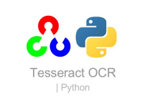
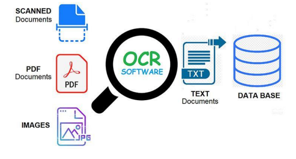
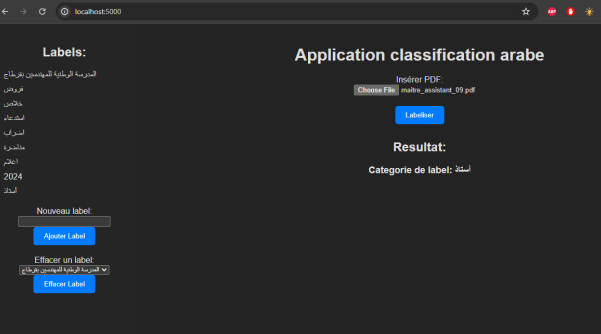

# Arabic Documents classification app based on OCR

)


this project is a Python OCR(Optical Caracter Recognition) (html , css , JS) for frontend. 
It is a document classification app based on labels that the user can add or delete. 
The system transforms PDF into images (if the pdf has more than one page it becomes many images) .Then the program tries to figure out if it matches any of the labels , if not it will try to add a new label based on the keywords of the pdf. 
Finally a new directory will be formed and will be named that keyword with the pdf associated to.





## License
[](https://choosealicense.com/licenses/mit/)


## Contributing

Contributions are always welcome!


## Installation

In order to make the app works, user should install flask with pip. Installing  tesseract may need some time. Remember to install tesseract with full options or to add the arabic languge manually to it in order to make the program functional.


For python dependencies , make sure to install the relevent dependencies using pip or pip3. 
```bash
pip install flask

pip install pytesseract

```

## Screenshots




## Optimizations

For Optimizations and future steps , it would be great to make the type of input more global and to develop the research of the label selection method in both cases:whether that label exists or not. 

